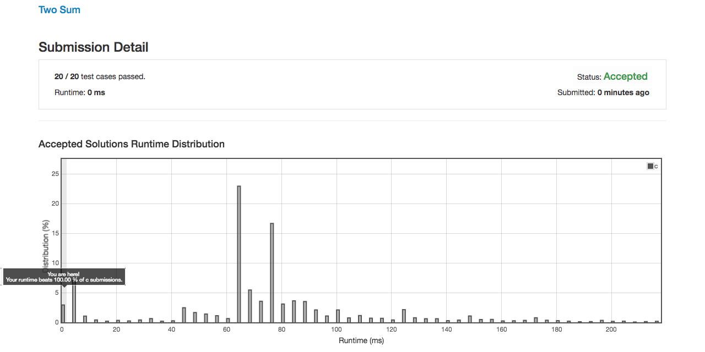
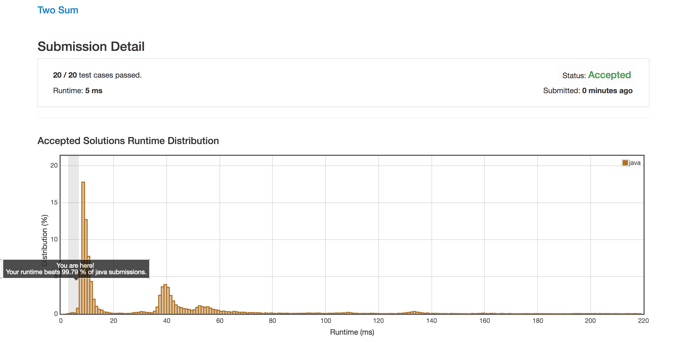
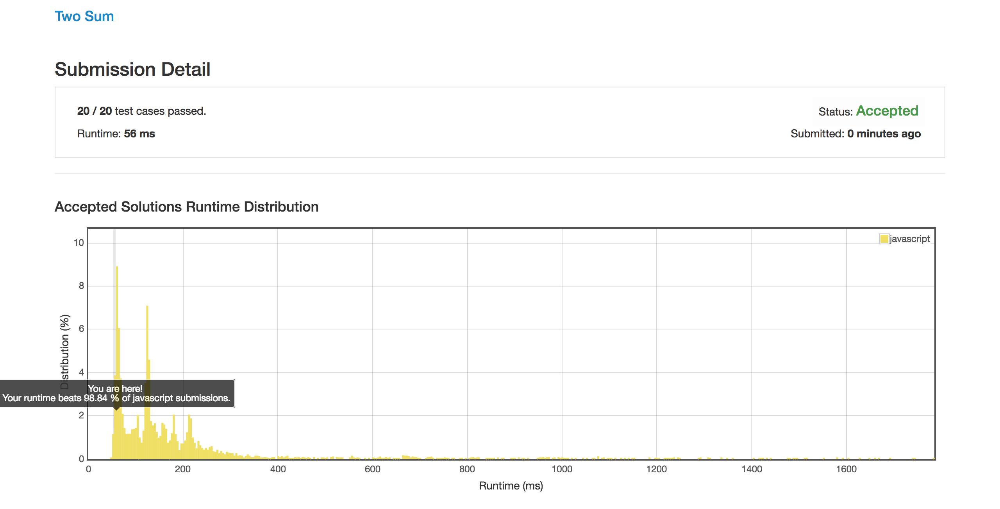

# Two Sun

Given an array of integers, return indices of the two numbers such that they add up to a specific target.

You may assume that each input would have exactly one solution, and you may not use the same element twice.

**Example:**
```
Given nums = [2, 7, 11, 15], target = 9,

Because nums[0] + nums[1] = 2 + 7 = 9,
return [0, 1].
```

## Solution
- [C](#)
- [Java](#java)
- [JavaScript](#javascript)
- [Python](#python)


## C

### Code
```C
typedef struct hashNode {
    int key;
    int value;
}hashNode;

typedef struct hashMap{
    struct hashNode** hashTable;
    int size;
}hashMap;

static inline hashMap* hash_Init(int size)
{
    hashMap* hm = malloc(sizeof(hashMap));
    hm->hashTable = calloc(size, sizeof(hashNode*));
    hm->size = size;
    return hm;
}

static inline void hash_destroy(hashMap* hm)
{
    int i= 0;
    int size = hm->size;
    hashNode** ht = hm->hashTable;
    hashNode* hn;
    
    for( i = 0; i < size; i++ )
    {
        if( (hn = ht[i]) )
            free(hn);
    }
    
    free(ht);
    free(hm);
}

static inline hashNode* hash_get(hashMap* hm, int key)
{
    hashNode* node;
    hashNode** ht = hm->hashTable;
    int size = hm->size;
    int h = abs(key) %  size;
    
    while((node = ht[h]))
    {
        if(node->key != key)
        {
            if(h < size - 1)
                h++;
            else
                h = 0;
        }
        else
            return node;
    }
    
    return NULL;
}

static inline void hash_set(hashMap* hm, int key, int value)
{
    hashNode** ht = hm->hashTable;
    hashNode* node;
    int size = hm->size;
    int h = abs(key) % size;
    
    while(ht[h])
    {
        if(h < size - 1)
            h++;
        else
            h = 0;
    }
    
    node = malloc(sizeof(hashNode));
    node->key = key;
    node->value = value;
    ht[h] = node;
}


int* twoSum(int* nums, int numsSize, int target) {
    int i,rest;
    hashNode *hn;
    hashMap *hm;
    int* r = malloc(2 * sizeof(int));
    hm = hash_Init(numsSize * 2);
    
    for( i = 0; i < numsSize; i++ )
    {
        rest = target - nums[i];
        hn = hash_get( hm, rest );
        if( hn )
        {
            r[0] = hn->value;
            r[1] = i;
            hash_destroy( hm );
            return r;
        }
        else
        {
            hash_set( hm, nums[i], i ) ;
        }
    }
    
    hash_destroy( hm );
    return NULL;
}
```

### Rating


## Java

### Code
```java
class Solution {
    public int[] twoSum(int[] nums, int target) {
        
    int[] arr_pt = new int[60000];
    int result = 0;
    int offset = 10000;
    
    for(int i = 0; i < nums.length; i++) {
        arr_pt[nums[i] + offset] = i;
    }
    
    for(int i = 0; i < nums.length; i++) {
        if (arr_pt[target - nums[i] + offset] != 0) {
            result = i;
            break;
        }
    }
        
    return new int[]{result, arr_pt[target - nums[result] + offset]};
    }
}
```
### Rating


## JavaScript

### Code

```javascript
/**
 * @param {number[]} nums
 * @param {number} target
 * @return {number[]}
 */
var twoSum = function(nums, target) {

    var map = {};
    
    for(var i in nums) {
        if(map[target-nums[i]] >= 0) {  
            return [map[target-nums[i]], +i];
        }
        
        map[nums[i]] = +i;
    }
};
```
### Rating



## Python 

### Code

```python
class Solution(object):
    def twoSum(self, nums, target):
        """
        :type nums: List[int]
        :type target: int
        :rtype: List[int]
        """
        dic  = {}
        for index, value in enumerate(nums):
            diff = target-value
            if diff in dic:
                return [dic[diff],index]
            dic[value] = index
```